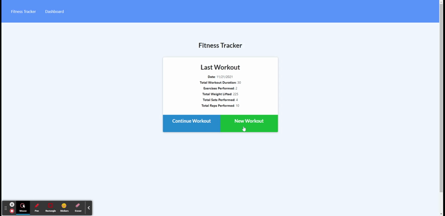

# NoSQL-workout-tracker-MR

    

### **Navigation**

[Description](#description) / [Questions](#questions)

-------

## **Description** 
A daily workout tracker for the gym rat on the go. 

--------

## A gif walkthrough

---------

## **Questions:**

### **What licenses are needed?**
    "NPM"   
    "dotenv": "^10.0.0",
    "express": "^4.16.3",
    "mongoose": "^5.3.16",
    "morgan": "^1.9.1"

### **Installation**
npm -i

### **Testing** 
There are no tests

### **Will it be maintained?** 
it will not be maintained

### **Can I contribute?** 
You cannot contribute

